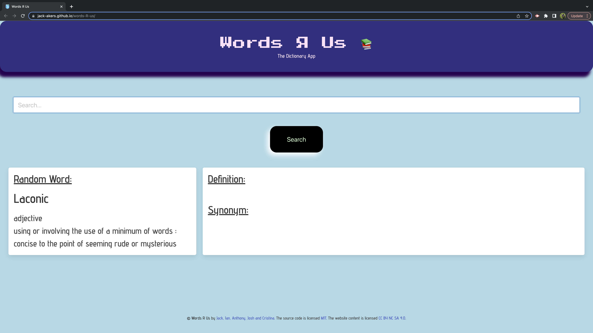
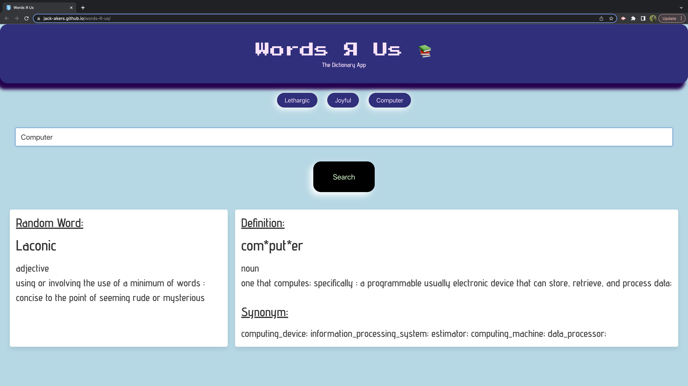
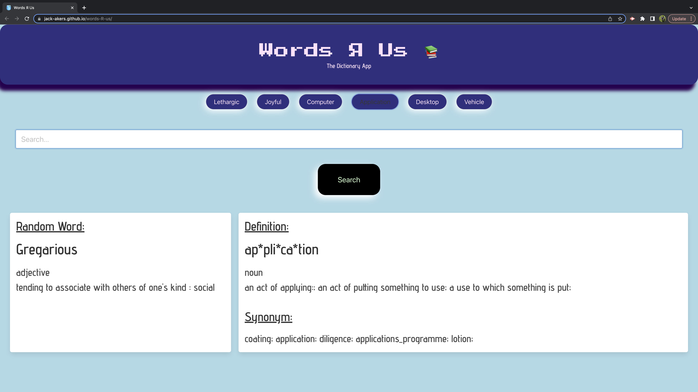

# words-R-us

## User Story: 
AS A student,
I WANT to be able to easily search a word and find its definition and synonyms,
SO THAT I can expand my vocabulary and communicate more effectively in both written and spoken forms.

## Acceptance Criteria:
GIVEN a dictionary web application with a search input,
WHEN I search for a word,
THEN I am presented with its definition and synonyms.
WHEN I refresh the page,
THEN I am able to learn a new random word of the day.
WHEN I view the search history,
THEN I am presented with a list of saved words from the previous word searches.

## Description
The Words R Us Application is a user-friendly tool designed to help students easily search for word definitions and synonyms. With a simple search input, users can quickly find the meaning and related words for any word they enter. The application also provides a "Random Word" feature to learn a new random word upon page refresh. Additionally, users can view their search history, allowing them to conveniently access previously searched words. The project aims to assist students in expanding their vocabulary and improving their written and spoken communication skills.

Overall, the development of the Words R Us Application allowed us to further refine our web development, API integration, user experience design, and data storage skills. By addressing the need for an efficient and user-friendly tool to support vocabulary expansion and effective communication, we hope to empower students in their language learning endeavors.

## Table of Contents

- [Installation](#installation)
- [Usage](#usage)
- [Credits](#credits)
- [License](#license)

## Installation

To install the Words R Us Application, follow these steps:

1. Clone the repository on your local machine using the following command:

git clone https://github.com/jack-akers/words-R-us.git

2. Navigate to the repository's directory using the command:

cd words-R-us

3. Open the index.html file in a web browser.

## Usage

To use the Words R Us Application, follow these steps:

1. Open the Words R Us Application in your web browser.
2. Use the search bar to search for a word.
3. The application will display the searched words definition and synonyms.
4. When the page is refreshed, the application will display a new random word and its definition.
5. The application will display your search history at the top of the page, click on a searched word button.
6. The application will display the searched words definition and synonyms.

Deployed website:

https://jack-akers.github.io/words-R-us/

Screenshot of the Words R Us Application:

   

## Credits

Collaborators for the Words R Us Application:

Ian Rattigan - https://github.com/Rattjohn

Anthony Diserafino - https://github.com/Anthony-D99

Jack Akers - https://github.com/jack-akers

Joshua Fisher - https://github.com/JoshuaBFisher1

Cristina Alzuri - https://github.com/calzu0821

We used the following third-party assets in this project:

- https://www.flaticon.com/
- https://fonts.google.com/
- https://jqueryui.com/
- https://bulma.io/
- https://dictionaryapi.com/
- https://api-ninjas.com/api/thesaurus
- https://www.youtube.com/watch?v=qgmLDPLApBY

## License

<!-- MIT License -->
